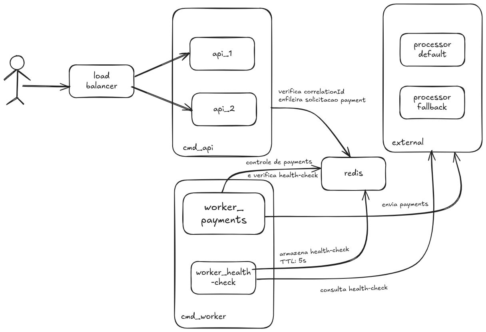

# 🏆 Rinha Backend 2025

## 🎯 Sobre o Desafio

Este projeto participa da **[Rinha de Backend 2025](https://github.com/zanfranceschi/rinha-de-backend-2025)**, um desafio que testa a capacidade de construir sistemas altamente escaláveis e resilientes. O objetivo é desenvolver um backend que intermedie solicitações de pagamentos para serviços de processamento, maximizando o lucro através da escolha inteligente entre dois processadores de pagamento com taxas diferentes.

### 🎲 Regras do Jogo
- **Objetivo**: Maximizar lucro processando pagamentos com a menor taxa possível
- **Processadores**: Dois serviços com taxas diferentes - default menor (5%), fallback maior (10%)
- **Instabilidade**: Ambos processadores podem ficar instáveis ou indisponíveis
- **Auditoria**: Endpoint de resumo para verificação de consistência pelo "Banco Central"
- **Performance**: Bônus baseado no p99 de tempo de resposta (até 20% para p99 ≤ 1ms)
- **Penalidades**: Multa de 35% por inconsistências detectadas

## 🏗️ Arquitetura

O sistema segue uma arquitetura distribuída com alta disponibilidade:




### 🔄 Fluxo de Processamento
1. **Recebimento**: Nginx distribui requisições entre duas APIs
2. **Validação**: API valida e cria lock no Redis para evitar duplicação
3. **Enfileiramento**: Pagamento é enfileirado para processamento assíncrono
4. **Health Check**: Worker monitora saúde dos processadores a cada 5s e escolhe o melhor processador disponível
5. **Processamento**: Worker consome fila de pagamentos e realiza requisições para processadores de pagamento
6. **Auditoria**: Sistema persiste pagamentos com sucesso para endpoint de resumo

## 🛠️ Tecnologias

### Backend
- **Web Api**: **PHP** com **Hyperf/Nano Framework**
- **Health-Check Worker**: **PHP** + **Swoole**
- **Payments Worker**: **PHP** + **Swoole**
- **Database/Cache**: **Redis**

### Infraestrutura
- **Containerização**: **Docker**
- **Orquestração**: **Docker-compose**
- **Load Balancer**: **Nginx**

## 📊 Recursos (Limite: 1.5 CPU + 350MB)

| Serviço | CPU | Memória | Função |
|---------|-----|---------|---------|
| nginx | 0.2 | 40MB | Load Balancer |
| api_1 | 0.3 | 105MB | REST API |
| api_2 | 0.3 | 105MB | REST API |
| worker_payments | 0.4 | 40MB | Processamento |
| worker_health | 0.1 | 20MB | Health Check |
| redis | 0.2 | 40MB | Cache/Queue |

**Total**: 1.5 CPU cores / 350MB RAM ✅

## 🎯 Estratégias

### Performance
- **Corrotinas Swoole**: I/O não-bloqueante
- **Connection Pooling**: Reutilização de conexões Redis
- **Load Balancing**: Distribuição inteligente de carga
- **Worker Pool**: Múltiplos workers são utilizados para processar pagamentos em paralelo

### Resilência
- **Health Check Automático**: Monitoramento contínuo dos processadores
- **Fallback Inteligente**: Escolha automática do melhor processador

### Escalabilidade
- **Redis como Fila**: Processamento assíncrono
- **Sistemas distribuídos**: Múltiplas instâncias com responsabilidades definidas
- **Resource Limits**: Controle preciso de recursos

## 🚀 Como Buildar a Aplicação

### Pré-requisitos
- Docker e Docker Compose
- Git

### Desenvolvimento
```bash
# Clone o repositório
git clone <seu-repo>
cd rinha-backend-2025

# Iniciar ambiente de desenvolvimento
./dev.sh up

# Ou manualmente
docker-compose -f docker-compose.dev.yml up --build -d
```

### Produção (Teste Final)
```bash
# Iniciar ambiente de produção
./dev.sh prod

# Ou manualmente
docker-compose up --build
```

### Comandos Úteis
```bash
./dev.sh up                    # Desenvolvimento com hot-reload
./dev.sh logs worker_payments  # Ver logs de um serviço específico
./dev.sh restart              # Reiniciar todos os serviços
./dev.sh prod                 # Produção (como será na Rinha)
./dev.sh monitor              # Monitorar recursos em tempo real
./dev.sh clean                # Limpar containers e volumes
```

## 📈 Monitoria

### Monitoramento em Tempo Real
```bash
# Monitoramento contínuo
./dev.sh monitor

# Ou diretamente
./monitor.sh --watch
```

### Métricas Monitoradas
- **CPU**: Uso por serviço e total
- **Memória**: Consumo por serviço e total
- **Limites**: Comparação com limites da Rinha
- **Status**: Saúde dos containers

### Exemplo de Saída
```
┌─────────────────┬─────────┬─────────────────┬─────────┬─────────┐
│ SERVIÇO         │ CPU %   │ MEMÓRIA         │ MEM %   │ LIMITE  │
├─────────────────┼─────────┼─────────────────┼─────────┼─────────┤
│ nginx           │ 0.1%    │ 15MB            │ 75%     │ 20MB    │
│ api_1           │ 0.2%    │ 45MB            │ 56%     │ 80MB    │
│ api_2           │ 0.2%    │ 43MB            │ 54%     │ 80MB    │
│ worker_payments │ 0.3%    │ 38MB            │ 54%     │ 70MB    │
│ worker_health   │ 0.05%   │ 18MB            │ 60%     │ 30MB    │
│ redis           │ 0.1%    │ 35MB            │ 50%     │ 70MB    │
├─────────────────┼─────────┼─────────────────┼─────────┼─────────┤
│ TOTAL           │ 0.95%   │ 194MB           │ 55%     │ 350MB   │
└─────────────────┴─────────┴─────────────────┴─────────┴─────────┘
```

## 📋 Endpoints

- `POST /payments` - Recebe solicitações de pagamento
- `GET /payments-summary` - Resumo para auditoria

---
